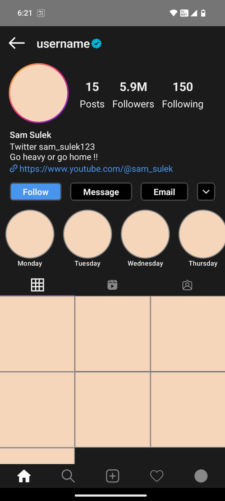

# 🌙 Dark Mode Instagram Profile UI - Jetpack Compose

A sleek **Instagram Profile UI in dark mode**, built entirely using **Jetpack Compose**. This project replicates the core layout of Instagram's profile screen including:

- 🧑‍💼 Header section with profile picture, bio, and buttons  
- 📊 Followers/Following/Post counts  
- 🟣 Story highlights section with scrollable icons  
- 🖼️ Grid layout for user posts

This is a **UI clone only**, designed for educational and prototyping purposes.

---

## 🚀 Features

- 100% Jetpack Compose – no XML
- Modular and reusable components
- Beautiful dark theme styling
- Scrollable layout with dynamic content
- Easy to extend or integrate into other projects

---

## 📸 Screenshots

>  
---

